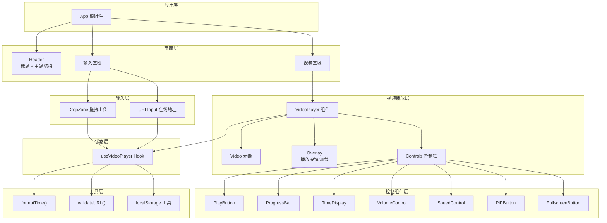
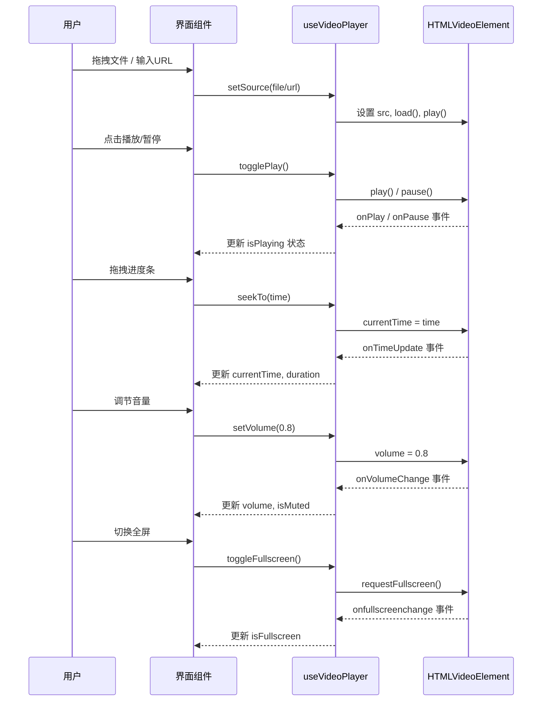
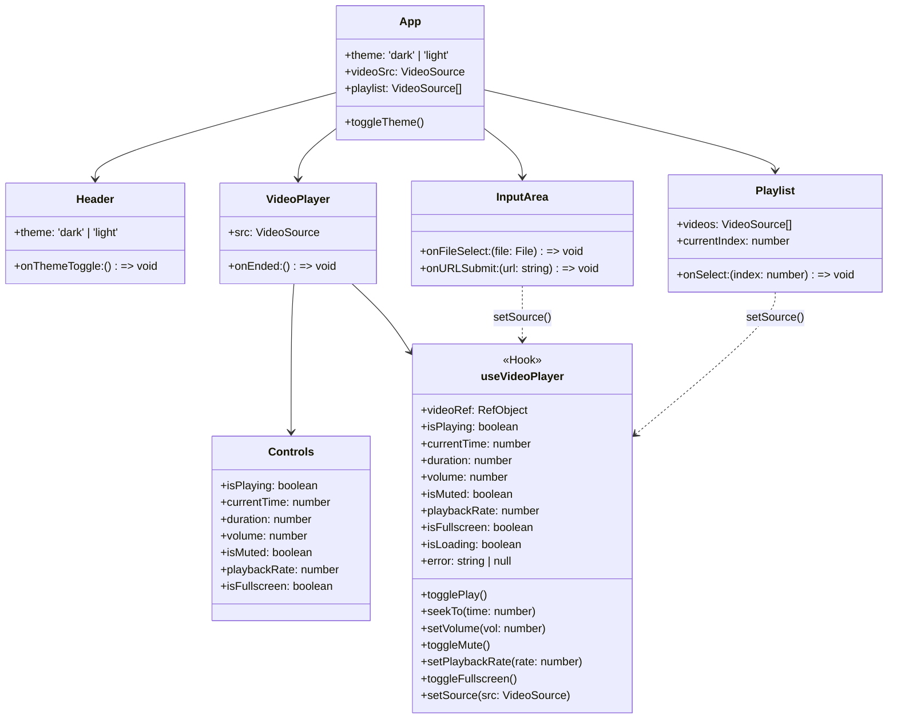
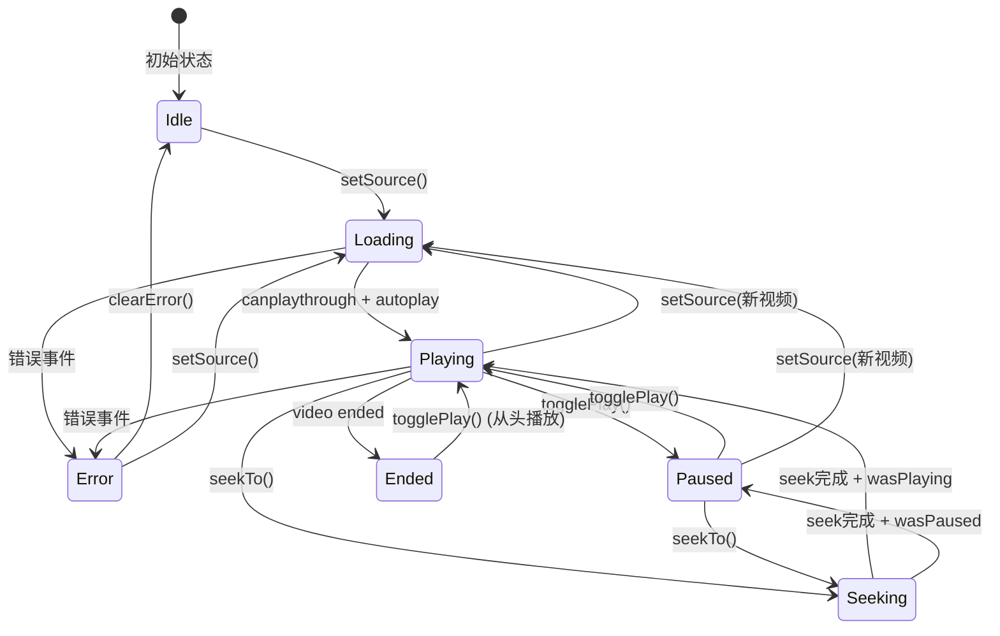

# 系统设计: 在线视频播放器

## 1. 技术架构



## 2. 数据流图



## 3. 组件关系图



## 4. 播放器控制状态机



## 5. 关键设计决策

| 决策点 | 方案 | 理由 |
|--------|------|------|
| 状态管理 | 自定义 Hook | 项目简单，无需 Redux/Zustand |
| 视频格式 | HLS.js + 原生 | 覆盖 mp4/webm + m3u8 流 |
| 样式方案 | Tailwind CSS | 快速开发 + 暗色主题支持 |
| 全屏API | 原生 Fullscreen API | 浏览器原生支持，简单可靠 |
| PiP | 原生 PiP API | 浏览器原生，优雅降级 |
| 持久化 | localStorage | 保存偏好设置，无需后端 |
| 测试 | Vitest + React Testing Library | 与 Vite 生态一致 |

## 6. 目录结构

```
video-player/
├── public/
│   └── favicon.svg
├── src/
│   ├── components/
│   │   ├── Header.tsx
│   │   ├── VideoPlayer.tsx
│   │   ├── Controls/
│   │   │   ├── index.tsx
│   │   │   ├── PlayButton.tsx
│   │   │   ├── ProgressBar.tsx
│   │   │   ├── TimeDisplay.tsx
│   │   │   ├── VolumeControl.tsx
│   │   │   ├── SpeedControl.tsx
│   │   │   ├── PiPButton.tsx
│   │   │   └── FullscreenButton.tsx
│   │   ├── InputArea/
│   │   │   ├── index.tsx
│   │   │   ├── DropZone.tsx
│   │   │   └── URLInput.tsx
│   │   └── Playlist.tsx
│   ├── hooks/
│   │   └── useVideoPlayer.ts
│   ├── utils/
│   │   ├── formatTime.ts
│   │   ├── validateURL.ts
│   │   └── storage.ts
│   ├── types/
│   │   └── video.ts
│   ├── __tests__/
│   │   ├── formatTime.test.ts
│   │   ├── useVideoPlayer.test.ts
│   │   └── components/
│   │       ├── VideoPlayer.test.tsx
│   │       └── Controls.test.tsx
│   ├── App.tsx
│   ├── main.tsx
│   └── index.css
├── package.json
├── tsconfig.json
├── vite.config.ts
├── tailwind.config.js
├── PROJECT.md
├── PRD.md
└── system_design.md
```
